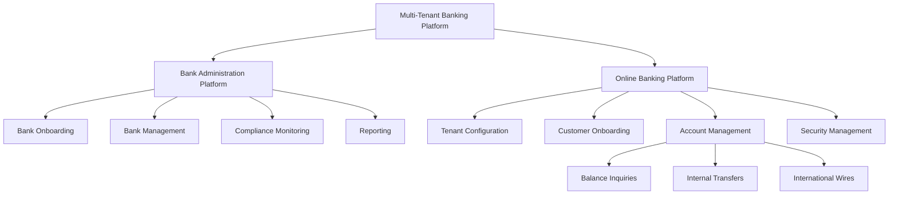
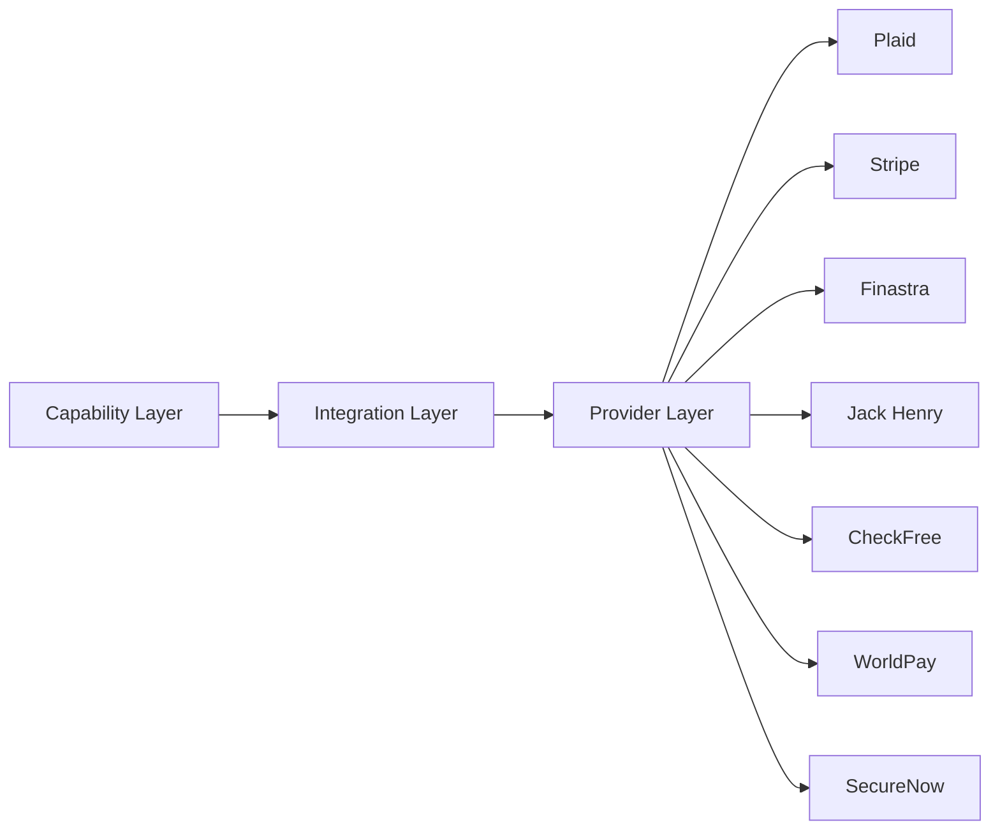

# Provisional Patent Application

## FIELD OF THE INVENTION

The present invention relates to the field of financial technology, specifically to a multi-tenant banking platform that enables financial institutions to provide customized digital banking services to their customers. The invention encompasses methods and systems for managing bank onboarding, administration, and customer-facing online banking services within a single, integrated platform.

## BACKGROUND OF THE INVENTION

In recent years, the financial services industry has undergone significant digital transformation. Traditional banks and financial institutions are facing increasing pressure to provide modern, user-friendly digital services to their customers. However, developing and maintaining sophisticated online banking platforms can be costly and time-consuming, especially for smaller institutions.

Existing solutions often require banks to choose between off-the-shelf products that lack customization options or building expensive proprietary systems from scratch. There is a need for a flexible, scalable platform that allows financial institutions of all sizes to quickly deploy and manage customized digital banking services without the overhead of developing and maintaining the underlying technology infrastructure.

## SUMMARY OF THE INVENTION

The present invention addresses these challenges by providing a comprehensive multi-tenant Software as a Service (SaaS) platform for digital banking. The platform consists of two main components:

1. A Bank Administration Platform: This component allows platform administrators to onboard new banks, manage bank profiles, monitor compliance, and generate reports across all tenant institutions.

2. A Multi-Tenant Online Banking Platform: This customer-facing component enables individual banks to provide branded digital banking services to their end-users, including account management, balance inquiries, and various types of financial transactions.

The invention leverages a modular architecture with standardized capabilities that can be integrated with various financial service providers. This approach allows for flexibility in implementation while maintaining a consistent user experience across different banking institutions.

## BRIEF DESCRIPTION OF THE DRAWINGS

Figure 1: High-level architecture of the multi-tenant banking platform

Figure 2: Integration architecture showing the relationship between capabilities, integrations, and providers

## DETAILED DESCRIPTION OF THE INVENTION

The multi-tenant banking platform of the present invention is designed to provide a comprehensive solution for financial institutions to offer digital banking services. The platform is built on a modular architecture that separates concerns into distinct layers: capabilities, integrations, and providers.

### Bank Administration Platform

The Bank Administration Platform is a core component of the invention, designed for use by platform administrators to manage the overall system and its tenant banks. Key features include:

1. Bank Onboarding: This module streamlines the process of adding new financial institutions to the platform. It includes functionality for creating bank profiles, uploading necessary documentation, and configuring bank-specific settings.

2. Bank Management: Administrators can monitor and manage existing banks in the system through a centralized dashboard. This includes features for managing bank users and viewing detailed activity logs for each institution.

3. Compliance Monitoring: The platform includes tools for tracking the compliance status of each bank and scheduling regular compliance reviews, ensuring all tenant institutions meet regulatory requirements.

4. Reporting: Comprehensive reporting tools allow administrators to generate usage reports and export bank data for analysis and stakeholder communication.

### Multi-Tenant Online Banking Platform

The customer-facing component of the invention enables individual banks to provide branded digital banking services to their end-users. Key features include:

1. Tenant Configuration: Each bank can customize the appearance of their banking portal with their own branding elements, including logos, colors, and fonts.

2. Customer Onboarding: End-users can verify their banking relationships and create online banking accounts through a streamlined process.

3. Security Management: The platform provides robust security features, including two-factor authentication options that can be configured by individual users.

4. Account Management: Users can view account balances, perform internal transfers between accounts, and initiate international wire transfers.

### Capability Layer

The capability layer defines standardized interfaces for common banking operations. This abstraction allows for consistent functionality across different provider integrations. Key capabilities include:

1. Account Management: This capability handles operations such as retrieving account balances, processing internal transfers, and initiating international wire transfers.

2. Tenant Management: This capability manages multi-tenant configuration and branding settings for banking institutions.

### Integration Layer

The integration layer implements the capabilities using specific provider APIs. This layer translates the standardized capability interfaces into provider-specific API calls. Examples of integrations include:

1. Plaid Banking Integration: Implements the Account Management capability using Plaid's banking APIs for account balance retrieval and transfer operations.

2. Finastra Tenant Management Integration: Implements the Tenant Management capability using Finastra's Fusion platform for managing tenant branding and configurations.

### Provider Layer

The provider layer represents the various financial service providers that can be integrated into the platform. Each provider has its own connection types and authentication methods. Examples of providers include:

1. Plaid: Used for banking APIs and account aggregation.
2. Stripe: Provides payment processing capabilities.
3. Finastra: Offers core banking and tenant management features.
4. Jack Henry Banking: Provides core banking software and technology solutions.
5. CheckFree: Offers electronic payment processing services.
6. WorldPay: Provides global payment processing capabilities.
7. SecureNow: Offers cybersecurity solutions for digital banking.

## CLAIMS

1. A multi-tenant banking platform comprising:
   a) a bank administration component for managing multiple financial institutions;
   b) a customer-facing online banking component customizable for each financial institution;
   c) a capability layer defining standardized interfaces for banking operations;
   d) an integration layer implementing said capabilities using various financial service provider APIs;
   e) a provider layer representing different financial service providers.

2. The platform of claim 1, wherein the bank administration component includes modules for bank onboarding, bank management, compliance monitoring, and reporting.

3. The platform of claim 1, wherein the customer-facing online banking component includes modules for tenant configuration, customer onboarding, security management, and account management.

4. The platform of claim 1, wherein the capability layer includes standardized interfaces for account management and tenant management operations.

5. The platform of claim 1, wherein the integration layer includes implementations for multiple financial service providers, allowing for flexible integration options.

6. A method for providing multi-tenant banking services, comprising:
   a) onboarding a financial institution onto a shared platform;
   b) configuring branding and settings specific to said financial institution;
   c) providing end-users of said financial institution with access to branded digital banking services;
   d) processing banking operations through a standardized capability layer;
   e) integrating with various financial service providers through an abstracted integration layer.

7. The method of claim 6, further comprising monitoring compliance status of multiple financial institutions through a centralized administration interface.

8. The method of claim 6, wherein processing banking operations includes retrieving account balances, performing internal transfers, and initiating international wire transfers.

9. The method of claim 6, wherein integrating with various financial service providers includes dynamically selecting appropriate providers based on operation type and institutional preferences.

## NOVEL ASPECTS & ADVANTAGES

1. Multi-tenancy: The platform allows multiple financial institutions to operate on a shared infrastructure while maintaining strict data isolation and customized branding.

2. Modular Architecture: The separation of concerns into capability, integration, and provider layers allows for flexibility in implementation and easier maintenance.

3. Standardized Capabilities: By defining standard interfaces for banking operations, the platform ensures consistency across different provider integrations and simplifies the addition of new providers.

4. Customization and Branding: Each tenant bank can customize their digital banking interface, providing a unique user experience for their customers while benefiting from a shared underlying platform.

5. Compliance Management: Centralized tools for monitoring and managing compliance across multiple financial institutions streamline regulatory adherence.

6. Scalability: The platform's architecture allows for easy scaling to accommodate growth in both the number of tenant banks and end-users.

7. Cost-Effectiveness: By sharing infrastructure and development costs across multiple institutions, the platform makes advanced digital banking capabilities accessible to smaller banks and financial institutions.

8. Rapid Deployment: New banks can be quickly onboarded and configured, allowing them to offer digital banking services to their customers in a fraction of the time required for traditional solutions.

## CONCLUSION

The multi-tenant banking platform described in this provisional patent application represents a significant advancement in the field of financial technology. By providing a flexible, scalable, and customizable solution for digital banking services, the invention enables financial institutions of all sizes to offer modern, user-friendly online banking experiences to their customers. The modular architecture and standardized capabilities ensure that the platform can evolve with the rapidly changing financial services landscape, providing long-term value to both financial institutions and their end-users.