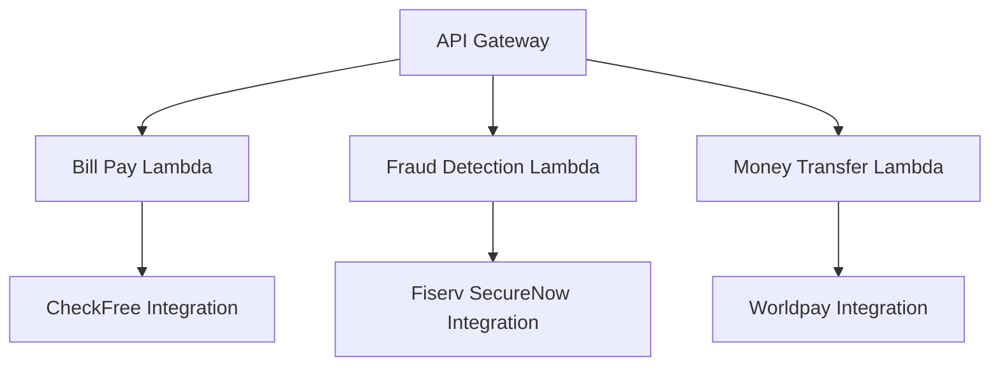

# Example Bank A Stack

This project contains the AWS CDK code for deploying the Example Bank A stack. The stack includes API Gateway and Lambda functions for bill payment, fraud detection, and money transfer capabilities.

## Architecture Overview

The Example Bank A stack consists of the following components:



1. **API Gateway**: Serves as the entry point for all API requests.
2. **Lambda Functions**:
   - Bill Pay Lambda: Handles bill payment operations.
   - Fraud Detection Lambda: Manages fraud detection and risk assessment.
   - Money Transfer Lambda: Processes money transfer requests.
3. **Integrations**:
   - CheckFree: Used for bill payment processing.
   - Fiserv SecureNow: Provides fraud detection capabilities.
   - Worldpay: Handles money transfer operations.

## Prerequisites

Before you begin, ensure you have the following installed:

- Node.js (v14.x or later)
- AWS CLI (configured with appropriate credentials)
- AWS CDK CLI (v2.x)

## Setup

1. Clone this repository:
   ```
   git clone <repository-url>
   cd source/account/reference-fintech/stack/example-bank-a
   ```

2. Install dependencies:
   ```
   npm install
   ```

3. Build the project:
   ```
   npm run build
   ```

## Useful Commands

- `npm run build`: Compile TypeScript to JavaScript
- `npm run watch`: Watch for changes and compile
- `npm run test`: Run the Jest unit tests
- `cdk deploy`: Deploy this stack to your default AWS account/region
- `cdk diff`: Compare deployed stack with current state
- `cdk synth`: Emits the synthesized CloudFormation template

## Deployment

To deploy the stack to your AWS account:

1. Ensure your AWS CLI is configured with the correct credentials and region.

2. Run the following command:
   ```
   cdk deploy
   ```

3. Review the changes and confirm the deployment when prompted.

4. Once deployment is complete, the API Gateway URL will be displayed in the output.

## Testing

To test the deployed API:

1. Use the API Gateway URL provided in the deployment output.

2. Send HTTP requests to the following endpoints:
   - Bill Pay: `/bill_pay/{operation}`
   - Fraud Detection: `/fraud_detection/{operation}`
   - Money Transfer: `/money_transfer/{operation}`

Replace `{operation}` with the specific operation you want to test (e.g., `pay-bill`, `assess-session-risk`, `internal-transfer`).

## Customization

To customize the stack:

1. Modify the `lib/example-bank-a-stack.ts` file to add or change resources.
2. Update the Lambda function code in the respective integration directories.
3. Adjust the API Gateway routes in the stack file if needed.

## Security

Ensure that you follow AWS security best practices:

- Use least privilege permissions for IAM roles.
- Implement proper API authentication and authorization.
- Encrypt sensitive data at rest and in transit.

## Troubleshooting

If you encounter issues:

1. Check the CloudWatch Logs for each Lambda function.
2. Verify that the API Gateway routes are correctly configured.
3. Ensure that the necessary permissions are granted to the Lambda functions.

For more detailed troubleshooting, refer to the AWS documentation for CDK, API Gateway, and Lambda.

## Contributing

Please read the CONTRIBUTING.md file for details on our code of conduct and the process for submitting pull requests.

## License

This project is licensed under the MIT License - see the LICENSE.md file for details.